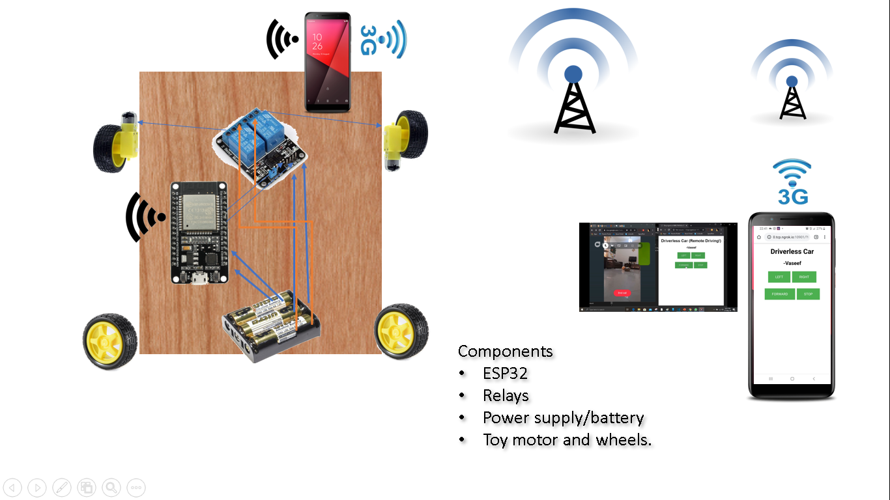
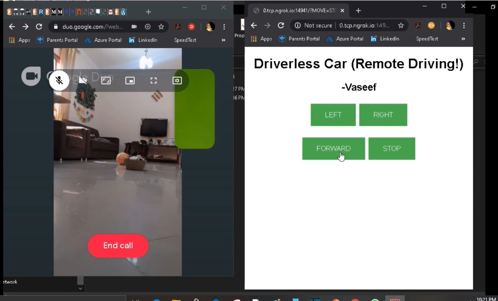

# Driverless Toy Car.

Driver less toy car which is controllable via internet.

https://youtu.be/uEH6olzndUM

Phase - 1.

Develop a navigation controller webpage to direct the toy car.

Make ESP32 as a web server and deploy the page in that.

Based on the use requests, control the relay to move the wheels.

Phase – 2.

Save the local wifi address to ThingSpeak(https://thingspeak.com/). This is to retrieve the local wifi address. You can use any other methods also for this, like Fing app.

Create a public DNS for the local IP address of the web server using ngrok (https://ngrok.com/) .

Fix a mobile phone on the toy car.

Start DATA (3G) network.

Start  wifi hotspot.

Face the camera to the front of the car as a driver view. 

Start a video call to your computer or mobile phone. 

Enjoy.
